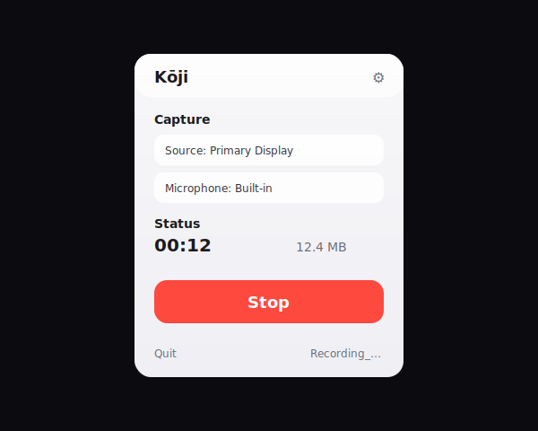

# Kōji

[](https://github.com/NumeroQuadro/koji-screen-recorder/actions/workflows/ci.yml)
[](https://support.apple.com/macos)

A minimal macOS menu-bar screen recorder that captures screen video + system audio + microphone audio (no virtual audio drivers).



## Features

- Menu-bar-only app (no Dock icon, no main window)
- Record full display, a window, or an application
- Captures system audio via ScreenCaptureKit (works with Bluetooth/AirPods output)
- Captures microphone audio (saved as a separate audio track)
- Saves to `~/Movies/Koji/` by default

## System Requirements

- macOS 14+ (Sonoma)
- Apple Silicon recommended (Intel supported)

## Install

1. Download `Koji.dmg`
2. Open it and drag `Koji.app` to `/Applications`
3. Launch `Koji.app`

## Uninstall

1. Delete `Koji.app` from `/Applications`
2. Remove preferences:
   ```bash
   defaults delete com.koji.screenrecorder
   ```
3. Remove recordings (optional):
   ```bash
   rm -rf ~/Movies/Koji/
   ```

If installed via Homebrew:

```bash
brew uninstall --cask koji
brew zap --cask koji
```

## Website (GitHub Pages)

The landing page lives in `docs/` (single-file `docs/index.html` + `docs/og-image.png`).

To enable GitHub Pages:

1. GitHub repo → **Settings** → **Pages**
2. Source: **Deploy from a branch**
3. Branch: `main` · Folder: `/docs`

To regenerate the Open Graph image:

```bash
swift scripts/generate_og_image.swift
```

## Install via Homebrew (when available)

Once published as a cask:

```bash
brew install --cask koji
```

While iterating, you can host your own tap and keep the cask updated with:

```bash
./scripts/update_cask.sh <version> <path-to-dmg>
```

## Auto Updates (Sparkle)

Kōji uses **Sparkle 2** for in-app updates.

- The app downloads `SUFeedURL` (`appcast.xml`) and looks for a newer version.
- The feed + update items are signed with your **EdDSA private key** and verified by the app using `SUPublicEDKey`.
- Until you host a real appcast, “Check for Updates…” will fail gracefully (expected).

### One-time Setup (Signing Key)

1. Generate an EdDSA signing key:
   ```bash
   ./scripts/generate_sparkle_keys.sh
   ```
   This stores the **private key** in your login Keychain and prints the **public key** you must keep in `Sources/Resources/Info.plist` as `SUPublicEDKey`.

2. Optional (CI / another machine): export the private key to a file and store it in a secure secret store:
   ```bash
   ./scripts/generate_sparkle_keys.sh --export "$HOME/.secrets/koji_sparkle_private_key"
   ```
   Never commit exported private keys.

### Hosting Your Appcast

Host `appcast.xml` and your `.dmg` releases on any HTTPS server (GitHub Releases, S3, etc). Then update `SUFeedURL` in `Sources/Resources/Info.plist` to point at your hosted `appcast.xml`.

### Publishing a New Version

1. Bump version in `Sources/Resources/Info.plist` (`CFBundleShortVersionString` + `CFBundleVersion`)
2. Build DMG
3. Sign + notarize
4. Run `generate_appcast` (via script):
   ```bash
   SPARKLE_DOWNLOAD_URL_PREFIX="https://yourdomain.com/releases/" \
   ./scripts/generate_appcast.sh ./dist/releases
   ```
5. Upload the new DMG(s) + `appcast.xml` to your host

## Building From Source

```bash
# Debug build
swift build

# Run from the command line (menu-bar app)
swift run Koji

# Release .app + DMG (ad-hoc signed by default)
./scripts/build.sh
```

To sign with a specific identity:

```bash
KOJI_SIGN_IDENTITY="Developer ID Application: Your Name (TEAMID)" ./scripts/build.sh
```

## Permissions

Kōji requires:

- **Screen Recording** — to capture your display
- **Microphone** — to record your voice (optional)
- **Notifications** — to show “Recording saved” and provide a one-click “Reveal in Finder” action

If permission is denied, Kōji will show guidance in the popover and will not start recording.

## Known Limitations

- The default build script uses **ad-hoc signing** (`codesign --sign -`). For sharing outside your machine, sign with a **Developer ID** and notarize.
- Microphone capture uses ScreenCaptureKit’s microphone support (available on newer macOS versions); older versions will record system audio only.

## License

MIT — see `LICENSE`.
